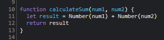

# DevTools - Debugging

1. The bug was that result was being assigned as a string, and num1 and num2 are both strings and get concatenated instead of being turned into numbers and getting added.
2. We can convert num1 and num2 to Numbers first, then add them together. 

